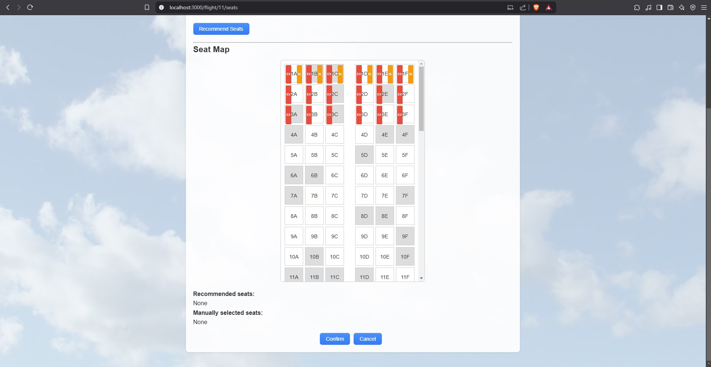
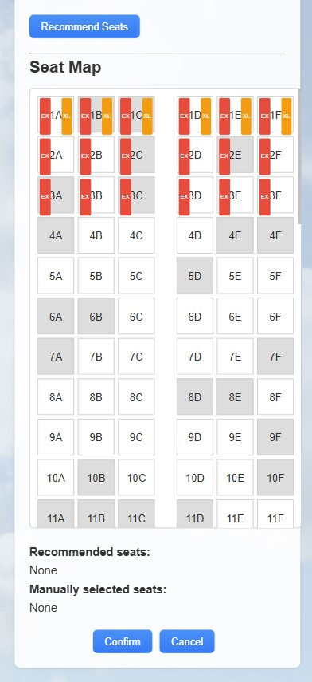

# CGI lennuplaneerija/istekohtade soovitaja

## Kasutatud tehnoloogiad

| Projektiosa    | Tehnoloogia |
| -------- | ------- |
| Backend                 | Spring Boot |
| Frontend                | React.js    |
| Andmebaas               | H2          |
| Project Object Model    | Maven    |
| Konteineriseerimine     | Docker    |
| Versioonihaldus         | Git    |

## Õpetus veebirakenduse jooksutamiseks

### Kui esineb probleeme veebirakenduse jooksutamisega, siis palun võtta ühendust järgmisel emaili aadressil: udras.karel@gmail.com

### 1.

Kõige lihtsam on veebirakendust jooksutada kasutades Dockerit.

1. Masin milles üritatakse veebirakendust jooksutada peaks masinasse olema installitud kas Docker Desktop või Docker Engine ning on oluline, et see töötaks järgmiste sammude ajal. Allpool on väljatoodud lingid selle installeerimiseks.

| OP Süsteem              | Link |
| --------                | ------- |
| Windows                 | [Docker Desktop](https://docs.docker.com/desktop/setup/install/windows-install/) |
| Mac                     | [Docker Desktop](https://docs.docker.com/desktop/setup/install/mac-install/) |
| Linux (Docker Desktop)  | [Docker Desktop](https://docs.docker.com/desktop/setup/install/linux/) |
| Linux (Docker Desktop)  | [Docker Engine](https://docs.docker.com/engine/install/)    |

2. Seejärel tuleks jooksutada käsurealt järgnevad käsud:

```
docker pull kareludr/flight-application:latest
docker run -p 8080:8080 kareludr/flight-application:latest
```

3. Seejärel jookseb veebirakendus localhosti 8080 pordil. Sellele saab ligi lingilt: [http://localhost:8080](http://localhost:8080).

### 2.

Samuti on võimalik ise ehitada Dockeri image.

1. Selleks on vaja projekti juurkaustast jooksutada järgmised koodiread ning eelmise variandiga on samuti sama see, et peab olemas olema Docker ja see peab jooksma.

```
docker build -t my-app:latest .
docker run -p 8080:8080 my-app:latest
```

2. Seejärel on veebirakendus leitav järgnevalt lingilt: [http://localhost:8080](http://localhost:8080).

### 3.

1. Viimane võimalus veebirakendust jooksutada on laadida projekt lingilt: [https://github.com/kareludras/cgi-flight](https://github.com/kareludras/cgi-flight) kas otse IDE-sse läbi selle võimaluste või on ka variant jooksutada järgmine käsk käsurealt. Siinkohal on samuti nõue, et git peaks installeeritud olema.

```
git clone https://github.com/kareludras/cgi-flight.git
```
2. Seejärel on vaja installeerida dependencies läbi IDE.

3. SeeJärel tuleb liikuda juurkaustast läbides teekonda /src/main/java/com.example.backend/BackendApplication ning seda jooksutada. See paneb käima veebirakenduse backendi.

4. Siis on vaja liikuda käsurealt(kui juba ei ole) juurkausta ning sisestada käsurealt järgmised käsud:

```
cd .\flight-frontend\
npm install
npm start
```

5. Seejärel on veebirakendus leitav järgnevalt lingilt: [http://localhost:3000](http://localhost:3000).

# Tööga seotud asjaolud

### Kulunud aeg: 18h

### Lennuk, millel kohti saab planeerida on Boeing 787-800 standardi järgi, kuid kohtade asetus on natuke erinev. Ülesandes olevad nõuded said kõik täidetud ning usun, et oleks veel palju, mida saaks paremaks teha, kuid sellisele veebirakendusele võibki jääda uusi lisasid arendama, seega usun, et proovitööks on see piisav. Samuti eeldasin, et exit row tähendab seda, et istekoht on päris väljapääsu juures ning lisasin mõlemas suunas 3 lähimat rida, sest sealt on garanteeritud kiire lennukis välja pääsemine. Ühtlasi ei loonud ma logini kuigi see võiks olemas olla ning samuti ei loonud ma headerit ega footerit, sest see ei tundunud nagu aja hea ära kasutamine. Veebirakendus on samuti loodud töötama enimkasutatud seadmetel nagu arvuti brauserid ja nutitelefoni brauserid.

### Asjad mida oleks saanud paremini teha olid tihedamini commitida. Kuna ma ei kasutanud issue trackerit, siis ei tekkinud ka otsest vajadust midagi commitida ning üks hetk oli projekt valmis. Ilmselt oleks issue trackeri kasutamine kasulik olnud ning oleks isegi vähem aega võtnud, jagades suuremad komponendid väiksemateks osadeks. Antud hetkel arendasin reeglina komponendi korraga ning ei mõelnud läbi, mida ma selleks tegema pean ning raiskasin selle peale aega. Samuti kui oleks teinud sisselogimise ja kasutajad, siis oleks olnud üsna lihtne veebirakendus github pages lehele üles panna ning see oleks veel lihtsam võimalus proovitööd esitada kui Dockeri image.

# All on väljatoodud ka mõned pildid veebirakendusest.








